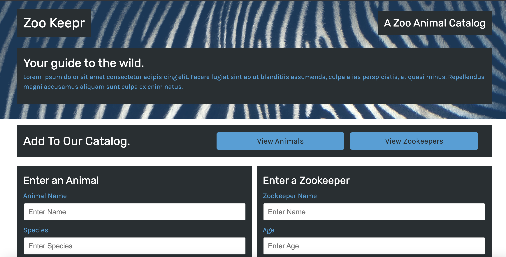

# Zookeeper - a Zoo animal catalog

### This app will use allow you to view and add animals and zookeepers at this zoo.
### Uses form input for entering animals and zookeepers and feild searches to display search results.

### badges

## Table of Contents

- [installation](#installation)
- [contribution guidelines](#contribution)
- [Test Instructions](#testing)
- [License](#license)
- [Questions](#questions)

### Installation
To use this app, you would have to clone the github repo and run it from the command line. using the local server as a host 'MPM start' and use the address bar path: http://localhost:3001/"

### Contribution Guidelines
N/A as of yet
### Testing
Multiple days were spent testing to ensure proper data was being written to the ReadMe.md file.
### Questions
    email address : kevinnivek@me.com
    - additional instructions 
    I can be contacted by phone as well, but prefer email contact first.

### Image of example readme.md

